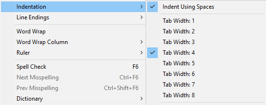
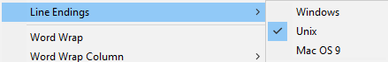

# Eko JavaScript Coding Style Guidlines

Motivation Statement - TBD

## Table of contents

- [Formatting](#formatting)
    + [4 Spaces for Indentation](#4-spaces-for-indentation)
    + [Unix newlines](#unix-newlines)
    + [No trailing whitespace](#no-trailing-whitespace)
    + [Blank lines](#blank-lines)
    + [Spacing](#spacing)
    + [Use semicolons](#use-semicolons)
    + [Use braces for all control structures (yes, even one-liners)](#use-braces-for-all-control-structures-yes-even-one-liners)
    + [Avoid long lines](#avoid-long-lines)
    + [Use single quotes](#use-single-quotes)
    + [Opening braces go on the same line](#opening-braces-go-on-the-same-line)
    + [Declare one variable per line](#declare-one-variable-per-line)
    + [Else/catch/finally clauses go on same line as previous closing bracket](#elsecatchfinally-clauses-go-on-same-line-as-previous-closing-bracket)
    + [Function expressions](#function-expressions)
    + [Switch statements](#switch-statements)
    + [Line wrapping](#line-wrapping)
- [Naming Conventions](#naming-conventions)
    + [Use lowerCamelCase for variables, properties and function names](#use-lowercamelcase-for-variables-properties-and-function-names)
    + [Use UpperCamelCase for class names](#use-uppercamelcase-for-class-names)
    + [Use UPPERCASE for Constants](#use-uppercase-for-constants)
- [Variables](#variables)
    + [Object/Array creation](#objectarray-creation)
- [Conditionals](#conditionals)
    + [Use strict equality](#use-strict-equality)
    + [Use descriptive conditions](#use-descriptive-conditions)
    + [Ternary expressions](#ternary-expressions)
- [Functions](#functions)
    + [Keep it short](#keep-it-short)
    + [Return early from functions](#return-early-from-functions)
    + [Return statements inside if/else](#return-statements-inside-ifelse)
    + [Method chaining](#method-chaining)
- [Comments](#comments)
    + [File description at top](#file-description-at-top)
    + [Code regions](#code-regions)
    + [Code comments](#code-comments)
- [Misc](#misc)
    + [Define variables in the smallest scope required](#define-variables-in-the-smallest-scope-required)
    + [Requires at top](#requires-at-top)
- [References](#references)


## Formatting

### 4 Spaces for Indentation

Each time a new block or block-like construct is opened, the indent increases by **4 spaces**.  
When block ends, the indent returns to previous indent level.  
**IMPORTANT** - always use spaces for indentation, never tab characters.



### Unix newlines

Use UNIX-style newlines (`\n`).  
All source files must end with a newline character.  
Windows style newlines (`\r\n`) should not be used.



### No trailing whitespace

Clean up any trailing whitespace before commiting.

**BAD**:
```javascript
// Some comment∙∙
let x = 5;∙∙∙∙
```

**GOOD**:
```javascript
// Some comment 
let x = 5;  
```

### Blank lines

Use a single empty line:

- Between consecutive methods in a class or object literal.
    + Exception: A blank line between two consecutive properties definitions in an object literal (with no other code between them) is optional.
      Such blank lines are used as needed to create *logical groupings* of fields.
- Within function bodies, sparingly to create *logical groupings* of statements.
- Blank lines at the start or end of a function body are not allowed.

*Multiple* consecutive blank lines are permitted, but never required.

### Spacing

A single whitespace character should be used for:

- Separating any reserved word (such as `if`, `for` or `catch`) from an opening parenthesis (`(`) that follows it on that line.
- Separating any reserved word (such as `else` or `catch`) from a closing curly brace (`}`) that precedes it on that line.
- Before any open curly brace (`{`)
    + Exception: Do not use a space before an object literal that is the first argument of a function or the first element in an array literal (e.g. `foo({a: [{c: 'd'}]})`).
- On both sides of any binary (e.g. `-`, `&&`, `+=`) or ternary (`cond ? a : b`) operator.
- After a comma (`,`) or semicolon (`;`). Note that spaces are *never* allowed before these characters.
- After the colon (`:`) in an object literal.
- After a comment's double slash (`//`).

**BAD**:
```javascript
let x=2*(y-1);
calc(x,y,z);

if(x>0){
    console.log('coolio');
}
```

**GOOD**:
```javascript
let x = 2 * (y - 1);
calc(x, y, z);

if (x > 0) {
    console.log('coolio');
}
```

### Use semicolons

Statements must be terminated with a semicolon, do not rely on automatic semicolon insertion. 

**BAD**:
```javascript
let y = 5
function identity(x) {
    return x
};
``` 

**GOOD**:
```javascript
let x = 5;
function identity(x) {
    return x;
}
```

### Use braces for all control structures (yes, even one-liners)

Braces are required for all control structures (i.e. `if`, `else`, `for`, `while` as well as any others),
even if body contains only a single statement.
The first statement of a non-empty bloack must begin on its own line.

**BAD**:
```javascript
if (true) console.log('coolio');
```

**GOOD**:
```javascript
if (true) {
    console.log('coolio');
}
```

Braces follow the K&R/egyptian-brackets style for *nonempty* blocks and block-like constructs:

- No line break before the opening brace.
- Line break after the opening brace.
- Line break before the closing brace.
- Line break after the closing brace *if* that brace terminates a statement or the body of a function.
    + There is **no linebreak** after the brace if it is followed by `else`, `catch`, `finally` or a comma, semicolon or right-parenthesis.

Note that empty blocks may be concise (closed immediately), like so:
```javascript
function doNothing() {}
```

### Avoid long lines

Lines that are longer than 80 characters should be avoided.
Consider line-wrapping, or shortening the line by defining additional variables for partial expressions.  
There might be some exceptions to this, for instance, a long URL should not be broken into separate lines if it exceeds the column limit.


**BAD**:
```javascript
if (rect.x >= 0 && rect.y >= 0 && rect.width >= 0 && rect.width <= 1920 && rect.height >= 0 && rect.height <= 1280) {
    // Do something
}
``` 

**GOOD**:
```javascript
var rectIsValid =
        rect.x >= 0 &&
        rect.y >= 0 &&
        rect.width >= 0 &&
        rect.width <= 1920 &&
        rect.height >= 0 &&
        rect.height <= 1280;

if (rectIsValid) {
    // Do something
}
```

### Use single quotes

Use single quotes, unless you are writing JSON.

**BAD**:
```javascript
console.log("coolio");
```

**GOOD**:
```javascript
console.log('coolio');
```

### Opening braces go on the same line

Your opening braces go on the same line as the statement.  
There should be exactly one whitespace character preceding the opening brace.

**BAD**:
```javascript
if (true)
{
    console.log('coolio');
}
```

**GOOD**:
```javascript
if (true) {
    console.log('coolio');
}
```

### Declare one variable per line

Each variable should be declared in its own line with its own `var/let/const` statement.  
The one exception here would be `for` loops, where you can declare multiple comma-delimited variables required for iterations in a single line.

**BAD**:
```javascript
let a, b, c;
```

**GOOD**:
```javascript
let a;
let b;
let c;
```

### Else/catch/finally clauses go on same line as previous closing bracket

An `else`, `catch` or `finally` clause should begin on the same line as previous closing bracket.

**BAD**:
```javascript
if (x > 0) {
    console.log('yay');
}
else if (x < 0) {
    console.log('nay');
}
// x === 0 || typeof x !== 'number'
else {
    console.log('coolio');
}
```

**GOOD**:
```javascript
if (x > 0) {
    console.log('yay');
} else if (x < 0) {
    console.log('nay');
} else /* (x === 0 || typeof x !== 'number') */ {
    console.log('coolio');
}
```

### Function expressions

When declaring an anonymous/arrow function as an argument to another function call, the body of the anonymous function should be indented +4 spaces.

**GOOD**:
```javascript
prefix.something.reallyLongFunctionName('whatever', (a1, a2) => {
    // Indent the function body +4 relative to indentation depth
    // of the 'prefix' statement one line above.
    if (a1.equals(a2)) {
        someOtherLongFunctionName(a1);
    } else {
        andNowForSomethingCompletelyDifferent(a2.parrot);
    }
});

some.reallyLongFunctionCall(arg1, arg2, arg3)
    .thatsWrapped()
    .then(function(result) {
        // Indent the function body +4 relative to the indentation depth
        // of the '.then()' call.
        if (result) {
            result.use();
        }
    });
```

### Switch statements

As with other blocks, the contents of a switch block are indented +4.
The contents of `case` and `default` clauses should be further indented +4.  

Braces for `case`/`default` clauses are optional, but should be used if clause contains lexical declarations (e.g. `let`, `const`).  

A `default` clause must be present and must be last, even if it doesn't do anything.
Each clause must end with either `break`, `return`, `throw` or a `// fall-through` comment.
An empty line between cases is optional.

**GOOD**:
```javascript
switch (animal) {
    case Animal.BANDERSNATCH: {
        let x = 2;
        handleBandersnatch(x);
        break;
    }

    case Animal.JABBERWOCK:
        handleJabberwock();
        // fall-through

    default:
        console.log('coolio');
        break;
}
```


### Line wrapping

Line wrapping is defined as breaking a single expression into multiple lines.
Often, there are several valid ways to line-wrap the same piece of code.
The typical reason for line-wrapping is to avoid long lines, but even code that would fit within the column limit may be line-wrapped at the author's discretion.
Clear code is preferred over code that fits in the smallest number of lines.
The following rules apply when line-wrapping:

- When a line is broken at an operator, the break comes after the symbol.
    + This does not apply to the "dot" (`.`), which is not actually an operator.
- When invoking a function, the function name must stay attached to the open parenthesis that follows it (`(`).
- A comma (`,`) stays attached to the token that precedes it.
- Continuation lines should be indented at least +8 spaces (could be more, but must be a multiple of 4)

**GOOD**:
```javascript
let myVar = x % 2 === 0 ?
                        'even' :
                        'odd';

currentEstimate =
        calc(currentEstimate + x * currentEstimate) /
        2.0;
```


## Naming Conventions

### Use lowerCamelCase for variables, properties and function names

Variables, properties and function names should use `lowerCamelCase`.
They should also be descriptive. Single character variables and uncommon abbreviations should generally be avoided.

**BAD**:
```javascript
let admin_user = db.query('SELECT * FROM users ...');
```

**GOOD**:
```javascript
let adminUser = db.query('SELECT * FROM users ...');
```

### Use UpperCamelCase for class names

Class names should be capitalized using `UpperCamelCase`.

**BAD**:
```javascript
function bank_Account() {
}

module.exports = bank_Account;
```

**GOOD**:
```javascript
function BankAccount() {
}

module.exports = BankAccount;
```

### Use UPPERCASE for Constants

Constants should use `UNDERSCORE_DELIMITED_UPPERCASE`.

**BAD**:
```javascript
const kSecondsInDay = 60 * 60 * 24;
```

**GOOD**:
```javascript
const SECONDS_IN_DAY = 60 * 60 * 24;
```

## Variables

### Object/Array creation

Use the literal syntax for object creation (i.e. don't ever use `new Object()`);  
Use trailing commas and put *short* declarations on a single line.  
Only quote keys when your interpreter complains.

**BAD**:
```javascript
let a = [
    'hello', 'world'
];
let b = {"color": 'black'
    , background-color: 'white'};
```

**GOOD**:
```javascript
let a = ['hello', 'world'];
let b = {
    color: 'black',
    'background-color': 'white',
};
```

## Conditionals

### Use strict equality

Always use `===` and `!==` operators (as opposed to `==` and `!=`).

**BAD**:
```javascript
if (0 == '') {
    console.log('OH NO!!!');
}
```

**GOOD**:
```javascript
if (0 === '') {
    console.log('OH NO!!!');
}
```

### Use descriptive conditions

Any non-trivial conditions should be assigned to a descriptively named variable or function.

**BAD**:
```javascript
if (password.length >= 4 && /^(?=.*\d).{4,}$/.test(password)) {
    console.log('coolio');
}
```

**GOOD**:
```javascript
let isValidPassword = password.length >= 4 && /^(?=.*\d).{4,}$/.test(password);

if (isValidPassword) {
    console.log('coolio');
}
```

### Ternary expressions

Do not use ternary (conditional) operator with boolean values,
the entire expression can be written more succintly without using a ternary operator.

**BAD**:
```javascript
function myFunc(x) {
    return x === 3 ? true : false;
}

function myOtherFunc(x) {
    return x === 3 ? false : true;
}
```

**GOOD**:
```javascript
function myFunc(x) {
    return x === 3;
}

function myOtherFunc(x) {
    return x !== 3;
}
```

For long ternary expressions, you can line-wrap. Keep your operators at the end of lines, like so:
```javascript
let myVar = someCondition && someOtherCondition ?
        'option a' :
        'option b';
```

## Functions

### Keep it short

Try to keep your functions short.
Aim for an upper limit of ~15 lines of code per function.

### Return early from functions

To avoid deep nesting of `if` statements, always return a function's value as early as possible.
Use an exit clause (an `if` clause that returns or throws).
Among other things, this is useful for argument validation and keeps the code looking cleaner by reducing unnecessary indentation.

**BAD**:
```javascript
function myFunc(myArg) {
    if (myArg > 0) {
        // Do stuff ...
    }
}
```

**GOOD**:
```javascript
function myFunc(myArg) {
    if (typeof myArg !== 'number' || myArg <= 0) {
        return;
    }

    // Do stuff ...
}
```

### Return statements inside if/else

If an `if/else` clause contains a `return` (or `throw`) statement, do not use `else` for next clause.

**BAD**:
```javascript
function myFunc() {
    if (someCondition) {
        return 0;
    } else if (someOtherCondition) {
        return 1;
    } else {
        return 2;
    }

    // The following code will never be executed,
    // but it might not be immediately apparent from a quick glance at code structure
    console.log('coolio');
}
```

**GOOD**:
```javascript
function myFunc() {
    if (someCondition) {
        return 0;
    }
    if (someOtherCondition) {
        return 1;
    }

    return 2;
}

```

### Method chaining

One method per line should be used if you want to chain methods.  
You should indent these methods so it's easier to twell they are part of the same chain.

**BAD**:
```javascript
myArr.filter(x => x > 0).map(x => x * 2)
.forEach(x => console.log(x));
```

**GOOD**:
```javascript
myArr
    .filter(x => x > 0)
    .map(x => x * 2)
    .forEach(x => console.log(x));
```

## Comments

### File description at top

Each code file should contain a short description at the top, using a multiline `/* ... */` style comment.
Subsequent lines must start with `*` that's aligned with the `*` on the previous line.
Do not use two asterisks in opening (`/**`) as that is reserved for JSDoc.
Files with JSDoc do not need this comment as well.

```javascript
/*
 * Adapter for "Player.js" spec (required for "embed.ly" support).
 * Based on http://playerjs.io/
 */
```

### Code regions

Using comments to divide your code into regions is encouraged.
This practice is prevalent in other languages/IDEs (i.e. [#pragma mark](http://nshipster.com/pragma/) in XCode, [#region](https://docs.microsoft.com/en-us/dotnet/csharp/language-reference/preprocessor-directives/preprocessor-region) in Visual Studio),
and it promotes good habits and more organized code.
It provides better readability and as the code evolves, keeps things organized.  

A developer adding a function to a file that is divided into regions, has to be thoughtful of where the function should go.
Just this extra second of thought may have a positive impact - which existing region should this go in? Should I add another region? Does this function really belong in this file? etc.  

Some examples of regions might be: `Require Dependencies`, `Members`, `Private Methods`, `Public Methods`, `Exported API` or anything else that makes sense.

```javascript
// ========================================================
// Exported API
// ========================================================

module.exports = {
    getCoolio: function() {
        return 'coolio';
    }
};

```

### Code comments

Use `//` for single and multiline code comments.
Comments should be indented at the same level as surrounding code.
Always have exactly one space after opening a line comment `//` and start sentences with an uppercase letter.
You can use `/* ... */` for inline comments.  

Make sure to comment any non-trivial code, and do not add extraneous comments.
Whenever possible, try to write code that is self explanatory so it doesn't require comments.

**BAD**:
```javascript
//execute a regex
var matches = item.match(/ID_([^\n]+)=([^\n]+)/);

function loadUser(id, cb) { //usage: loadUser(5, function() { ... })
    // ...
}

/* Check if the session is valid */
var isSessionValid = (session.expires < Date.now());
// If the session is valid
if (isSessionValid) {
    // ...
}

someFunction(obviousParam, true, 'hello');
```

**GOOD**:
```javascript
// 'ID_SOMETHING=VALUE' -> ['ID_SOMETHING=VALUE', 'SOMETHING', 'VALUE']
var matches = item.match(/ID_([^\n]+)=([^\n]+)/));

// This function has a nasty side effect where a failure to increment a
// redis counter used for statistics will cause an exception. This needs
// to be fixed in a later iteration.
function loadUser(id, cb) {
    // ...
}

var isSessionValid = (session.expires < Date.now());
if (isSessionValid) {
    // ...
}

someFunction(obviousParam, true /* shouldRender */, 'hello' /* name */);
```


## Misc

### Define variables in the smallest scope required

Define variables in the smallest scope in which they are used, and closest to where they're first needed.

**BAD**:
```javascript
let i;
let l;

function myFunc(arr) {
    for (i = 0, l = arr.length; i < l; ++i) {
        // ...
    }
}
```

**GOOD**:
```javascript
function myFunc(arr) {
    for (let i = 0, l = arr.length; i < l; ++i) {
        // ...
    }
}
```

### Requires at top

Always put requires at top of file to clearly illustrate a file's dependencies.
Besides giving an overview for others at a quick glance of dependencies and possible memory impact, 
it allows one to determine if they need a package.json file should they choose to use the file elsewhere.


## References

The eko style guide borrows (steals) from the following style guides:
- [Google JS Guide](https://google.github.io/styleguide/jsguide.html)
- [Node Style Guide](https://github.com/felixge/node-style-guide)
- [Airbnb JavaScript Style Guide](https://github.com/airbnb/javascript)
